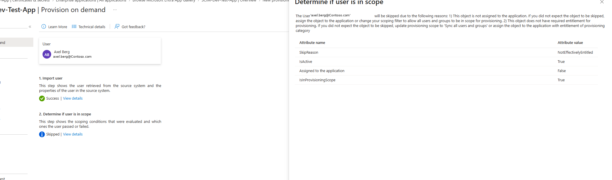
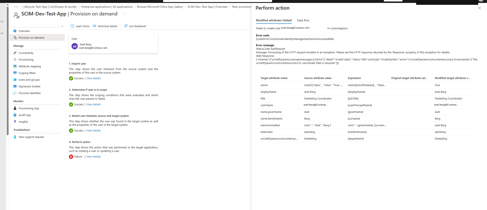
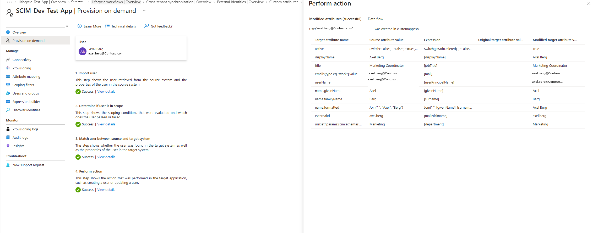
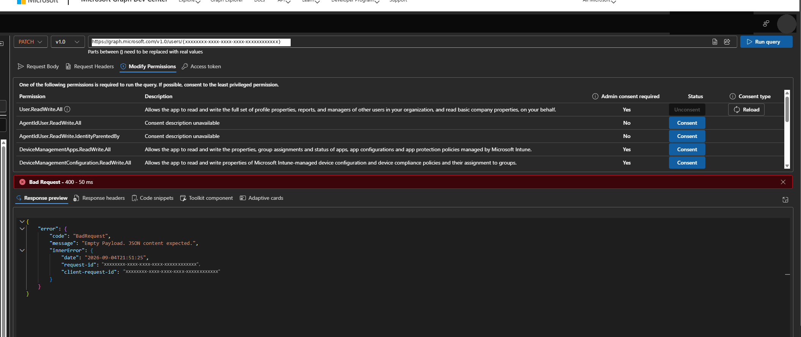
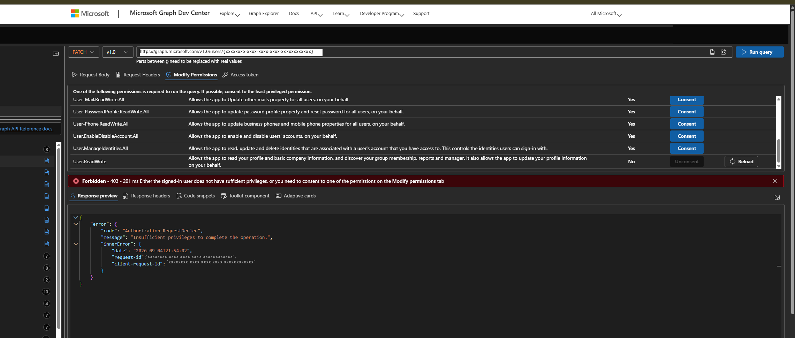
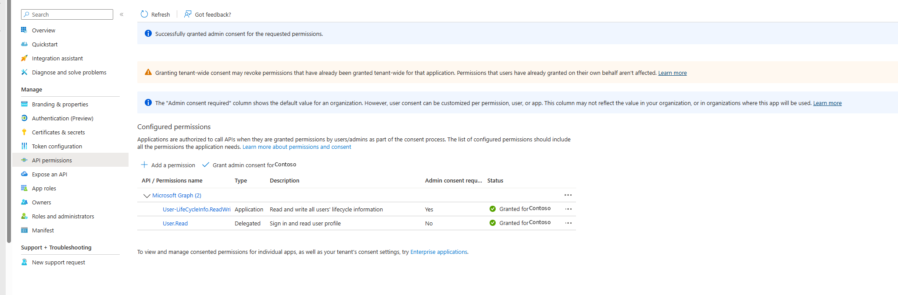

# Troubleshooting Log

Real problems hit while building and operating the midPoint + Microsoft Entra ID identity governance lab, documented as they happened. Each entry follows Problem → Investigation → Root Cause → Resolution → Lesson.

---

## 1. midPoint accounts not becoming governed users (sync-reaction gap)

**Problem**
Accounts created on the CSV-backed resource in midPoint showed up in the resource's account list, but never appeared as fully governed midPoint `User` objects — no role assignments, no certification visibility, nothing.

**Investigation**
Checked the resource's synchronization configuration and compared it against a resource where linking worked correctly. The working resource had synchronization reactions defined for each situation (`unmatched`, `linked`, `deleted`); the new resource did not.

**Root Cause**
midPoint doesn't automatically create or link `User` objects from raw accounts — synchronization only acts on situations you've explicitly mapped. With no reaction configured for `unmatched` accounts, midPoint saw the accounts but took no action on them.

**Resolution**
Added an explicit synchronization reaction for the `unmatched` situation (create a new `User`, link the account) to the resource's synchronization policy, then re-ran the import task. Accounts began correctly linking to governed `User` objects.

**Lesson**
In midPoint, discovery and governance are two separate steps. Seeing an account on a resource means nothing until a synchronization reaction says what to do about it.

---

## 2. SCIM provisioning to a non-gallery app — two failures before success

**Problem**
Provisioning a synthetic user (`axel.berg`) on demand to a custom SCIM 2.0 test application (`SCIM-Dev-Test-App`, backed by scim.dev) failed, but with two different causes across two attempts.

**Investigation — Attempt 1: scope error**

The provisioning run reported the user as **Skipped**, with reason code `NotEffectivelyEntitled`. The detail panel pointed to two possible causes: the object wasn't assigned to the application, or it lacked the required entitlement.

**Root Cause 1**
The user had not actually been assigned the enterprise application, so Entra correctly determined they were out of scope for provisioning — the scoping filter and role assignment step had been skipped when the app was set up.

**Resolution 1**
Assigned the user directly to the `SCIM-Dev-Test-App` enterprise application and re-triggered provisioning.

**Investigation — Attempt 2: schema error**

The user was now in scope, but the provisioning attempt failed with a 400 Bad Request: `SystemForCrossDomainIdentityManagementServiceIncompatible`, with a SCIM error body stating the `emails` field was required.

**Root Cause 2**
The attribute mapping sent a SCIM payload that didn't include an `emails` field — the target app's SCIM implementation required it per the RFC 7643 core user schema, but the default mapping template didn't populate it.

**Resolution 2**
Added an explicit attribute mapping for `emails` (mapped from the user's mail attribute), saved the mapping, and re-ran provisioning on demand.

**Success**

All four provisioning steps completed successfully and the user appeared in the target application with the `emails` field populated.

**Lesson**
SCIM failures come in layers: an authorization/scope failure and a schema/payload failure look similar (both surface as a failed provisioning cycle) but require completely different fixes. Read the specific error code and body before assuming you know which layer failed.

---

## 3. Least-privilege app registration for a Lifecycle Workflows attribute write

**Problem**
An app registration needed permission to write `employeeLeaveDateTime` on user objects via Microsoft Graph, to support a Lifecycle Workflows leaver trigger. The goal was the narrowest permission that would work — not the easy answer of a broad, well-known scope.

**Investigation — Attempt 1**

Granted `User.ReadWrite.All` (a broad, general-purpose Graph permission) and tested a PATCH request against the user resource via Graph Explorer. Result: `400 Bad Request — Empty Payload. JSON content expected.`

**Root Cause 1**
Not a permissions issue at all — a malformed request body. Ruled this out and moved to permissions testing directly.

**Investigation — Attempt 2**

With the payload fixed, retried using a broader permission set including `User.ManageIdentities.All`. Result: `403 Forbidden — Insufficient privileges to complete the operation (Authorization_RequestDenied)`.

**Root Cause 2**
Even a broad-sounding permission set didn't cover writes to `employeeLeaveDateTime` — it's gated behind a narrower, purpose-specific Graph permission, not general user-write scopes.

**Resolution**

Granted the narrow `User-LifeCycleInfo.ReadWrite.All` application permission instead, with admin consent. The write succeeded.

**Lesson**
Broader isn't always sufficient, and it's never free — `User.ReadWrite.All` would have technically worked for many other fields but is overkill for this single attribute and expands the app's blast radius unnecessarily. Lifecycle-related attributes in Entra ID often have their own dedicated permission that neither the broadest nor the second-broadest option covers; it's worth testing down to the narrowest permission that actually satisfies the write, rather than stopping at the first one that does.

---

## 4. Bulk provisioning auth failure at scale (interactive broker vs. app-only)

**Problem**
A bulk-provisioning run moving ~3,000 midPoint-sourced identities into Entra ID via Microsoft Graph PowerShell failed partway through unattended execution.

**Investigation**
The script had been developed and tested using an interactive sign-in (delegated permissions via the Web Account Manager broker), which worked fine for small manual test batches. Run unattended at scale, authentication began failing partway through the run.

**Root Cause**
Interactive, delegated auth depends on a live user session and token refresh flow that isn't designed to run unattended for long-running batch jobs — it isn't built for large volumes with no user present to reauthenticate.

**Resolution**
Re-architected the script to use app-only authentication with client credentials (a registered app with application-level Graph permissions and a client secret/certificate) instead of interactive delegated sign-in. This removed the dependency on a live session and let the full batch complete unattended.

**Lesson**
What works for a five-record interactive test doesn't necessarily survive a 3,000-record unattended run. Authentication method matters as much as permission scope when the shape of the job changes from "a person is present" to "nothing is watching."
